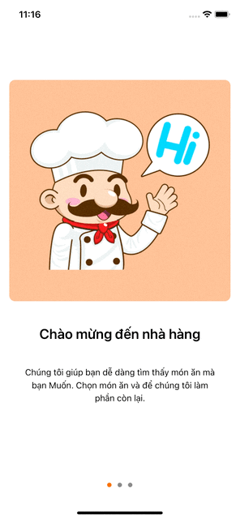

 This is the product at the end of the enriching skill course. 

## Demo

## Built With

* [SwfitUI](https://developer.apple.com/xcode/swiftui/) - To build user interfaces across all Apple platforms.
* MVVM Architectures
* [Xcode13.2](https://developer.apple.com/documentation/xcode-release-notes/xcode-12-beta-release-notes) - Latest beta version.

## Features

* On boarding page with custom animation 
* Doing...

## TO DO

* Home View.
