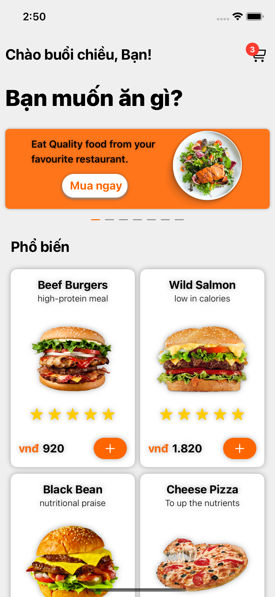

 This is the product at the end of the enriching skill course. 

## Demo

&nbsp; &nbsp; &nbsp; &nbsp;

## Built With

* [SwfitUI](https://developer.apple.com/xcode/swiftui/) - To build user interfaces across all Apple platforms.
* MVVM Architectures
* [Xcode13.2](https://developer.apple.com/documentation/xcode-release-notes/xcode-12-beta-release-notes) - Latest beta version.
* [Restful source](https://github.com/lnthe54/Food-RestFul) - To build Nodejs & MongoDB
* [API](https://theln-food.herokuapp.com/) - Deploy by Heroku

## Features

* On boarding page with custom animation 
* Home View with all food
* Detail View

## TO DO

* Cart View.
